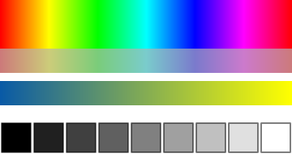

# canvas: drawing, animation and input

`#include <canvas.hpp>`

The `canvas` module is a C++ version of Princeton's
[StdDraw](https://introcs.cs.princeton.edu/java/stdlib/javadoc/StdDraw.html).
Everything is a free function in `namespace canvas`. The window opens on the
first drawing call and stays open after `main()` returns, until the user closes
it. Closing the window ends the program.

```cpp
#include <canvas.hpp>

int main() {
    canvas::setPenColor(canvas::BOOK_BLUE);
    canvas::filledCircle(0.5, 0.5, 0.25);
    canvas::setPenColor(canvas::BLACK);
    canvas::text(0.5, 0.1, "Hello, canvas!");
}
```

The header [`include/canvas.hpp`](../include/canvas.hpp) documents every function.

## Coordinates

By default the canvas is 512 × 512 pixels, with (0, 0) at the lower left and
(1, 1) at the upper right; y points up. Change the ranges with `setXscale`,
`setYscale` or `setScale`.

Pen widths and font sizes are in pixels, so they don't change when the scale
does.

Circles, squares and arcs are always round and square, even on a rectangular
canvas or when the x and y scales differ, as in a plot. Their radius or
half-length is measured in x units and used in both directions. `ellipse` and
`rectangle` take a separate half-width and half-height, and follow each axis's
scale.

### Origin at the top left, or pixel coordinates

A range can be given the other way round to flip an axis. With
`setYscale(1, 0)`, (0, 0) is the top-left corner and y grows downwards. Many
graphics libraries and games use pixel coordinates with the origin at the top
left, and that works too:

```cpp
canvas::setCanvasSize(800, 600);
canvas::setXscale(0, 800);
canvas::setYscale(600, 0);   // y from 0 at the top to 600 at the bottom
canvas::filledRectangle(50, 30, 40, 20);   // 40 pixels from the left, 30 from the top
```

Text and pictures stay upright, and the mouse position, the grid and
`snapshot()` follow the flipped axis. Two things to know with a flipped axis,
as in Princeton's StdDraw and Turtle:

- **Angles in `arc` and rotated `text`** are counterclockwise on the screen,
  so with y pointing down, angle 90 points up the screen, towards smaller y.
- **The turtle** works in your coordinates: with y pointing down, heading 90
  points down the screen, and `turnLeft` looks like a right turn.

## Functions

### Window and coordinates

| Function | Does |
|---|---|
| `setCanvasSize(width, height)` | Canvas size in pixels (default 512 × 512). Clears the canvas. |
| `setTitle(title)` | Window title (default `"canvas"`). |
| `setXscale(min, max)`, `setYscale(min, max)` | Range of x or y shown (default 0 to 1). |
| `setScale(min, max)` | Sets both ranges. |

### Pen, colors and text

| Function | Does |
|---|---|
| `setPenColor(color)`, `setPenColor(r, g, b)`, `penColor()` | Color for everything drawn (default `BLACK`). |
| `setPenWidth(pixels)`, `penWidth()` | Width of lines, outlines and points (default 2). |
| `setFontSize(pixels)` | Text height (default 16). |
| `setFont(ttfFile)` | Use a TrueType font file instead of the built-in one. |

**Colors.** `canvas::Color` has `r`, `g`, `b` and `a` (opacity) components from 0
to 255. Use `canvas::rgb(r, g, b)` or `canvas::rgb(r, g, b, a)` to make one from
`int` values: it clamps to 0–255, and unlike `Color{r, g, b}` it accepts `int`
variables. Colors can be compared with `==`. The predefined colors are:
`BLACK`, `WHITE`, `GRAY`, `LIGHT_GRAY`, `DARK_GRAY`, `RED`, `GREEN`, `BLUE`,
`CYAN`, `MAGENTA`, `YELLOW`, `ORANGE`, `PINK`, `BROWN`, `PURPLE`, and the
textbook's `BOOK_BLUE`, `BOOK_LIGHT_BLUE` and `BOOK_RED`. The `image` module
uses the same colors.

**Making colors.** Three functions make colors that are awkward to give as red,
green and blue:

| Function | Gives |
|---|---|
| `gray(level)` | A gray from 0 (black) to 255 (white). |
| `hsv(hue, saturation, value)` | A color from its hue, an angle on the color wheel in degrees (0 red, 60 yellow, 120 green, 180 cyan, 240 blue, 300 magenta), its saturation from 0 (gray) to 1 (pure), and its value from 0 (black) to 1 (bright). |
| `mix(a, b, t)` | A mix of colors `a` and `b`: `t = 0` gives `a`, `t = 1` gives `b`, and values between blend them. |

```cpp
for (int i = 0; i < 360; ++i) {           // a rainbow
    canvas::setPenColor(canvas::hsv(i, 1, 1));
    canvas::filledRectangle(i / 360.0, 0.5, 0.002, 0.2);
}
canvas::setPenColor(canvas::mix(canvas::BOOK_BLUE, canvas::WHITE, 0.5));   // a paler blue
```

Hue is the natural choice for colors that cycle, such as a color for each level
of a fractal, and `mix` for gradients and fades.



### Shapes

Shapes are positioned by their center. Outline shapes use the pen width, and
filled shapes are filled with the pen color.

| Outline | Filled | Size |
|---|---|---|
| `point(x, y)` | | a dot as wide as the pen |
| `line(x0, y0, x1, y1)` | | |
| `circle(x, y, radius)` | `filledCircle` | |
| `ellipse(x, y, halfWidth, halfHeight)` | `filledEllipse` | |
| `arc(x, y, radius, angle1, angle2)` | | degrees, counterclockwise from the x axis |
| `square(x, y, halfLength)` | `filledSquare` | |
| `rectangle(x, y, halfWidth, halfHeight)` | `filledRectangle` | |
| `polygon(points)` | `filledPolygon(points)` | closed |
| `polyline(points)` | | open, e.g. to plot a function |

`polygon`, `filledPolygon` and `polyline` take a list of `canvas::Point`, or the
x and y coordinates as two vectors:

```cpp
canvas::filledPolygon({{0.1, 0.1}, {0.5, 0.9}, {0.9, 0.1}});
canvas::polyline(xs, ys);   // std::vector<double> xs, ys of equal size
```

### Text

| Function | Does |
|---|---|
| `text(x, y, s)` | Text centered at (x, y). |
| `textLeft(x, y, s)`, `textRight(x, y, s)` | Text starting or ending at (x, y). |
| `text(x, y, s, degrees)` | Centered text, rotated counterclockwise. |

`text`, `textLeft` and `textRight` also take a number or a single character,
so a score needs no conversion: `canvas::text(0.5, 0.95, score)`. Numbers show
up to 6 significant digits (`3.14159`), and whole numbers all their digits
(`1000000`).

The built-in font is a subset of Noto Sans with Latin-1, Greek and common
punctuation. It doesn't have math symbols such as `≤` or `∞`; use `setFont`
with a font that has them.

### Pictures and the canvas

| Function | Does |
|---|---|
| `picture(x, y, file)` | Draws a .png, .jpg, .bmp or .gif file centered at (x, y), at its natural size. |
| `picture(x, y, file, width, height)` | The same, scaled to a width and height in user coordinates. |
| `picture(x, y, img)`, `picture(x, y, img, width, height)` | The same for an `image::Image` (see [image.md](image.md)). At natural size each image pixel covers exactly one canvas pixel. |
| `picture(x, y, file, degrees)`, `picture(x, y, file, width, height, degrees)` | Turned counterclockwise by `degrees` around (x, y), e.g. a sprite facing the way it moves. Also for an `image::Image`. |
| `save(file)` | Saves the canvas as .png, .jpg or .bmp, at the size set by `setCanvasSize`. |
| `snapshot()` | A copy of the canvas as an `image::Image`, to read or process its pixels. |

Files are looked up in the current folder first, and then in the folder of
the program itself. IDEs often run programs from a different folder, so this
finds files placed next to the program; the
[starter template](getting-started.md) copies its `data` folder there. The same
applies to `setFont` and to the `image` and `audio` modules.

### Animation

| Function | Does |
|---|---|
| `clear()`, `clear(color)` | Fills the canvas (default `WHITE`). |
| `enableDoubleBuffering()`, `disableDoubleBuffering()` | Draw off screen until `show()`. |
| `setFrameRate(fps)` | Makes `show()` wait so frames appear `fps` times a second (default 0: no waiting). |
| `show()` | Copies the canvas to the screen; with a frame rate, first waits until the frame is due. |
| `pause(ms)` | Waits. |

Normally each drawing call appears on screen right away. For smooth animation,
enable double buffering so that each frame appears all at once, and set a
frame rate:

```cpp
canvas::enableDoubleBuffering();
canvas::setFrameRate(60);
while (true) {
    canvas::clear();
    // ...draw the next frame...
    canvas::show();      // waits until the next frame is due
}
```

- **Same speed everywhere.** Without a frame rate, a loop runs as fast as the
  screen refreshes, which is 2.4 times as fast on a 144 Hz laptop as on a
  60 Hz monitor. With a frame rate it runs at the same speed everywhere.
- **Drawing time counts.** The time spent drawing counts toward the wait, so
  frames stay evenly spaced. A frame that takes longer than its slot is shown
  at once; the animation then just runs slower.
- **`pause(ms)`** is for waiting in other places, for example to show a
  message for two seconds. In a loop with a frame rate, don't also call
  `pause()`: each frame would wait twice. (Without a frame rate, a StdDraw-style
  `show(); pause(16);` loop works too.)

### Recording an animation

```cpp
canvas::startRecording("game.gif");
```

This records the canvas as an animated GIF, to share or to hand in. Every
frame (each `show()` or `pause()`) is recorded, and `stopRecording()` saves
the file. If the program doesn't call it, the file is saved when the program
ends, including when the window is closed, so a game loop that never ends can
still be recorded. The terminal says where the file went:

```
canvas: saved the recording 'game.gif' (12.4 seconds, 620 frames)
```

- **The recording keeps the intended speed.** Frame times come from the frame
  rate and from `pause()`, not from the clock, so a recording made on a slow
  computer, or headless, plays at the speed the animation is meant to run.
  Without either, frames are timed as they appear (a sixtieth of a second
  each when headless).
- **Frames that don't change** are merged into one longer frame, and the
  final picture stays for a second before the GIF starts again.
- **In slow motion** (`setDrawDelay`), each drawing call is a frame, which
  makes a GIF of a fractal being drawn.
- **Size and speed.** Recording takes about a millisecond per frame. A busy
  512 × 512 animation makes about 0.4 MB of GIF per second.
- **Limits.** A recording stops by itself after 60 seconds. GIF frames are at
  least a fiftieth of a second, so at 60 frames per second some frames are
  left out (the timing stays right). Colors are reduced to the GIF's palette,
  and smooth gradients may look slightly grainy. The grid and watched values
  are not recorded, as with `save()`.

### Mouse and keyboard

| Function | Does |
|---|---|
| `mouseX()`, `mouseY()` | Mouse position in user coordinates. |
| `isMousePressed()` | True while a mouse button is held down. |
| `mouseClicked()` | True once for each click in the current frame. |
| `hasNextKeyTyped()`, `nextKeyTyped()` | Characters typed in the current frame, oldest first. |
| `isKeyPressed(key)` | True while the key is held down, e.g. `canvas::Key::Left`. |
| `wasKeyPressed(key)` | True once for each press of the key in the current frame. |

`canvas::Key` has `A` to `Z`, `Num0` to `Num9`, `Space`, `Enter`, `Escape`,
`Backspace`, `Tab`, `Left`, `Right`, `Up`, `Down`, `Shift`, `Control` and
`Alt`.

**Input happens per frame.** `show()` and `pause()` end a frame. Clicks and
typed characters that the program didn't read during a frame are dropped when
the next frame starts, so a program that falls behind never reacts to old
input.

- `mouseClicked()` reports each click once. Clicks from earlier frames are
  forgotten.
- Up to 16 unread typed characters are kept; more, e.g. from pasting, are
  ignored. Only ASCII characters are reported. Enter is `'\n'`, Backspace
  `'\b'`, Tab `'\t'`, Escape 27 and Delete 127. Use `if` to handle one key per
  frame, or `while` to handle every key:

  ```cpp
  while (canvas::hasNextKeyTyped()) {
      char c = canvas::nextKeyTyped();
      // ...
  }
  ```

- `wasKeyPressed(key)` reports each press once, even a tap shorter than a
  frame; holding the key down doesn't repeat it. Use it for keys that do
  something once, such as turning in Snake or rotating a block in Tetris.
- `isKeyPressed(key)` and `isMousePressed()` report what is held down right
  now. Use them for keys held to move or steer.

```cpp
if (canvas::wasKeyPressed(canvas::Key::Left)) direction = turnLeft(direction);  // once per tap
if (canvas::isKeyPressed(canvas::Key::Space)) speed = 2;                        // while held
```

Input queries are cheap, about 50 ns, so a program can check the keyboard very
often, for example once per audio sample.

### Game helpers

Collisions and buttons come up in every game, and are easy to get subtly
wrong. Positions and sizes are as for drawing: a circle has a centre and a
radius, as in `filledCircle`, and a rectangle a centre, half width and half
height, as in `filledRectangle`.

| Function | Does |
|---|---|
| `distance(x0, y0, x1, y1)` | The distance between two points. |
| `circlesOverlap(x0, y0, r0, x1, y1, r1)` | True if the circles overlap. |
| `rectanglesOverlap(x0, y0, halfWidth0, halfHeight0, x1, y1, halfWidth1, halfHeight1)` | True if the rectangles overlap. |
| `circleOverlapsRectangle(cx, cy, radius, x, y, halfWidth, halfHeight)` | True if the circle and the rectangle overlap, e.g. a ball and a paddle. |
| `isMouseOver(x, y, halfWidth, halfHeight)` | True if the mouse is over the rectangle, e.g. a button. |

Shapes that just touch count as overlapping. For a circle and a rectangle the
rounded corners are taken into account: a ball near a corner doesn't collide
until it really touches.

```cpp
if (canvas::circleOverlapsRectangle(ballX, ballY, radius, padX, padY, 0.1, 0.015)) {
    ballVY = -ballVY;                                          // bounce off the paddle
}
if (canvas::mouseClicked() && canvas::isMouseOver(0.5, 0.2, 0.1, 0.05)) startGame();
```

When the x and y scales differ, circles are drawn round on the screen, so in
user coordinates they are not circles. The circle checks use the circles as
drawn, so they match what the player sees; `distance` is the plain distance
in user coordinates.

## Debugging aids

These help find out why a drawing doesn't look as expected. None of them
change what is drawn: `save()` and `snapshot()` give the same result with or
without them, and the grid and watched values appear only on the screen.

### Hints

When a drawing call probably doesn't do what was meant, a short hint is
printed to the terminal, once for each kind of problem. The program keeps
running.

| Mistake | Hint |
|---|---|
| A shape entirely outside the canvas, often because of pixel coordinates | `canvas: hint: circle at (200, 150) is outside the visible area (x from 0 to 1, y from 0 to 1). Coordinates go from 0 to 1 unless you change them with setScale().` |
| A shape in the background colour, so nothing changes | `canvas: hint: filledCircle at (0.8, 0.2) can't be seen: it is drawn in WHITE on a WHITE background. Change the colour with setPenColor().` |
| A fully transparent pen | `canvas: hint: the pen colour is fully transparent (alpha 0), so line draws nothing. Use an alpha above 0, or leave it out.` |
| Double buffering on, but `show()` never called for two seconds | `canvas: hint: enableDoubleBuffering() is on, so drawing appears on screen only when show() is called.` |

Shapes that are only partly outside the canvas, or drawn in white on top of
other colours, don't give hints. Hints are on by default.
`canvas::setHints(false)` turns them off, and so does the environment variable
`CANVAS_HINTS=0`, for example for an autograder.

### Coordinates in the title bar

```cpp
canvas::showMouseCoordinates();
```

The window title then shows where the mouse is, in your own coordinates:
`My program | x 0.534, y 0.210`. Point at something to find the numbers for
it, or check that `setScale` did what you expected. During an animation the
frame rate is shown too: `| 60 fps`. It keeps working after `main()` returns,
while the window stays open.

### A coordinate grid

```cpp
canvas::showGrid();        // a round step, about ten lines across
canvas::showGrid(0.25);    // or a step of your choice
canvas::hideGrid();
```

Light grid lines are drawn over the window, labelled with their coordinates
along the bottom and left edges; the lines through 0 are darker. The step is
the same for x and y unless their ranges are very different, as in a plot
with x from 0 to 100 and y from −1 to 1. The grid is drawn over the canvas
each time it is shown, so it doesn't need to be drawn again after `clear()`,
and it doesn't appear in `save()` or `snapshot()`.

### Watching values

```cpp
canvas::watch("vx", vx);
canvas::watch("state", "jumping");
canvas::unwatch("vx");
```

A box in the top-right corner of the window shows each watched value with its
name, such as `vx = 0.015`. Calling `watch` again with the same name updates
the value, so in an animation call it every frame, next to the drawing. It's
like printing with `std::cout`, but without filling the terminal 60 times a
second. Values are formatted as by `text()`: numbers, characters, `bool` and
strings.

### Slow motion

```cpp
canvas::setDrawDelay(30);   // 30 ms after every drawing call
```

After every drawing call the canvas is shown and the program waits, so you
can watch the order in which things are drawn: how a loop fills the canvas,
or how recursion builds a fractal (try it with `examples/textbook/htree.cpp`
or `examples/koch.cpp`). While it is on, double buffering is ignored, so each
step is visible. `setDrawDelay(0)` turns it off; in headless mode it never
waits.

### Debug keys

```cpp
canvas::enableDebugKeys();
```

turns on three keys for looking at an animation while it runs:

| Key | Does |
|---|---|
| P | Pauses at the next frame (`show()` or `pause()`), and resumes. |
| N | While paused, runs one more frame and pauses again. |
| G | Shows or hides the grid. |

While paused, the window title says so, and the grid, the mouse coordinates
in the title and the watched values still work, so you can look at the frame
closely. In slow motion, N runs one drawing call at a time.

The keys are off unless turned on, and while they are on the program doesn't
receive P, N and G, so they don't clash with the program's own keys. If a
game needs those letters, turn the debug keys off with `disableDebugKeys()`.

## Headless mode

If the environment variable `CANVAS_HEADLESS` is set to 1, no window is opened.
Drawing works as usual, `pause()` returns immediately, no input is ever
reported, and `save()` writes the canvas. Student code needs no changes, which
makes this useful for autograding:

```sh
CANVAS_HEADLESS=1 ./student_program && compare out.png expected.png
```

`save()` always writes the size set by `setCanvasSize`, even on high-DPI
screens, so output is the same on every machine. Recording works headless too,
at the intended speed, so animations can be graded from their GIF.

## Errors

Mistakes stop the program with a message and exit status 1, for example:

```
canvas: filledCircle: radius must not be negative
canvas: circle: an argument is NaN or infinite
canvas: picture: cannot open 'cat.png' (not in the current folder, /home/ana/game/build/)
canvas: polygon: x and y must have the same size
canvas: nextKeyTyped: no key was typed (check hasNextKeyTyped() first)
canvas: startRecording: 'game.mp4' must end in .gif
```

## Differences from Java's StdDraw

| StdDraw | canvas | Why |
|---|---|---|
| `setPenRadius(0.002)` | `setPenWidth(2)` | Pixels are easier to reason about, and widths don't change with the scale. |
| `getPenColor()` | `penColor()` | Shorter and C++-style. |
| `new Color(r, g, b)` | `canvas::rgb(r, g, b)` | Accepts `int` variables and clamps to 0–255. |
| `double[] x, double[] y` | `{{x, y}, ...}` or two vectors | Point lists read naturally, e.g. `polygon({{0, 0}, {1, 0}, {0.5, 1}})`. |
| — | `polyline(points)` | For plotting functions. |
| Polling `isMousePressed()` for clicks | `mouseClicked()` | Short clicks between two polls aren't missed. |
| Polling `isKeyPressed()` for key taps | `wasKeyPressed(key)` | Quick taps between two frames aren't missed. |
| `text(x, y, "" + score)` | `text(x, y, score)` | Numbers can be written directly. |
| Typed keys queue forever | Dropped at the end of each frame | A lagging program doesn't replay old keys. |
| Circles and squares stretch when the x and y scales differ | Always round and square; size in x units | A circle should look like a circle, and plot markers stay dots. |
| `pause(ms)` sleeps | `pause(ms)` keeps a steady frame rate | Smooth animation even when drawing takes time. |
| `show(); pause(16);` in every loop | `setFrameRate(60)` once | Says what is meant, and runs at the same speed on every screen. |
| — | `hsv`, `mix`, `gray` | Rainbows, gradients and grays without computing red, green and blue. |
| — | `startRecording("game.gif")` | Students can share and hand in animations. |
| — | Overlap checks, `isMouseOver` | Collisions and buttons without the usual mistakes. |
| Exceptions | Message and exit | Clearer for beginners than an uncaught exception. |

## How it works

- **Drawing.** Each call rasterizes straight into an RGBA canvas in memory, on
  the caller's thread. There is no render thread and no list of shapes.
- **Filled shapes** use exact-area coverage, so edges are antialiased and
  self-crossing polygons fill by the nonzero rule.
- **Lines and outlines** take their coverage from the distance to the line
  segments. That gives round joins and caps, and overlapping pieces join
  without visible seams.
- **Displaying.** SDL copies the canvas to a window texture: on `show()` with
  vsync in double-buffered mode, and otherwise automatically, at most about 60
  times a second. On high-DPI screens the canvas has more pixels than its
  logical size, so drawing stays sharp.
- **Text** uses stb_truetype, with the built-in font embedded in the library.
- **Recording** encodes each frame as it arrives, with
  [msf_gif](https://github.com/notnullnotvoid/msf_gif), so memory holds only
  the compressed GIF, not every frame.
- **Speed.** The library is compiled with optimization even when the student's
  project builds in Debug. A thousand small filled circles take about 1.5 ms.

## Examples

- [`examples/shapes.cpp`](../examples/shapes.cpp): one of each kind of shape.
- [`examples/bouncing_ball.cpp`](../examples/bouncing_ball.cpp): a
  double-buffered animation loop.
- [`examples/sketch.cpp`](../examples/sketch.cpp): drawing with the mouse,
  keys to change color, clear and save.
- [`examples/paddle.cpp`](../examples/paddle.cpp): a paddle game with a start
  button, collisions, sound effects, colors from `hsv` and the debug keys;
  `./paddle record` also records it to a GIF.
