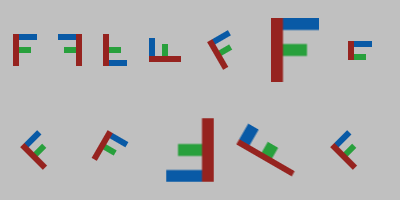

# image: images as grids of pixels

`#include <image.hpp>`

The `image` module is for image-processing exercises, like Princeton's
[Picture](https://introcs.cs.princeton.edu/java/stdlib/javadoc/Picture.html).
An `image::Image` is a struct you can copy, pass to functions and return from
them, and its pixels can be used like a 2D array: `img[row][col]`. The module
needs no window, so image programs can run anywhere, including on a grading
server.

```cpp
#include <canvas.hpp>
#include <image.hpp>

int main() {
    image::Image src = image::load("photo.png");
    image::Image out = image::create(src.width, src.height);
    for (int row = 0; row < src.height; ++row) {
        for (int col = 0; col < src.width; ++col) {
            image::Color c = src[row][col];
            int gray = (299 * c.r + 587 * c.g + 114 * c.b) / 1000;
            out[row][col] = image::rgb(gray, gray, gray);
        }
    }
    image::save(out, "gray.png");

    canvas::setCanvasSize(out.width, out.height);   // and show it
    canvas::picture(0.5, 0.5, out);
}
```

The header [`include/image.hpp`](../include/image.hpp) documents every function.

## The Image struct

```cpp
struct Image {
    int width = 0;
    int height = 0;
    std::vector<Color> pixels;   // row after row, top row first
};
```

## Rows and columns

Pixels are addressed by row and then column, like a 2D array, and the same
order is used everywhere: `img[row][col]`, `getPixel(img, row, col)` and
`setPixel(img, row, col, color)`. Row 0 is at the top and column 0 at the
left, as in image files and image editors. This is the opposite of
`canvas`'s y axis, which points up. The difference is deliberate: rows and
columns are positions in a grid, not coordinates.

```cpp
image::Color c = img[row][col];      // read a pixel
img[row][col] = image::RED;          // change it
img[row][col].g = 0;                 // change one component
```

`img[row][col]` checks that the pixel is inside the image and stops with a
clear message if it isn't, unlike an out-of-range index into an array. The
pixels are stored row after row in `img.pixels`: pixel (row, col) is
`pixels[row * width + col]`, which is unchecked.

## Functions

| Function | Does |
|---|---|
| `image::create(width, height)` | A new white image. |
| `image::create(width, height, color)` | A new image filled with the color. |
| `image::load(file)` | Reads a .png, .jpg, .bmp or .gif (first frame) file. |
| `image::save(img, file)` | Writes .png, .jpg or .bmp, chosen by the extension. PNG and BMP keep transparency; JPEG does not. |
| `img[row][col]` | A pixel, to read or change. |
| `image::getPixel(img, row, col)` | The color of a pixel; the same as `img[row][col]`. |
| `image::setPixel(img, row, col, color)` | Changes the color of a pixel; the same as `img[row][col] = color`. |

Files are looked up in the current folder first, and then in the folder of
the program itself, as described in [canvas.md](canvas.md#pictures-and-the-canvas).

## Transformations

Each of these returns a new image and leaves the original unchanged:

| Function | Gives |
|---|---|
| `image::flipHorizontal(img)` | The image mirrored left to right. |
| `image::flipVertical(img)` | The image upside down. |
| `image::rotate(img, degrees)` | The image turned counterclockwise (clockwise if negative). The result is just big enough to hold it, with transparent corners. Multiples of 90° move the pixels exactly; other angles blend neighbouring pixels. |
| `image::resize(img, width, height)` | The image stretched or shrunk to a new size. Shrinking averages the pixels each new pixel covers; enlarging blends between neighbours. |
| `image::crop(img, row, col, width, height)` | The `width` × `height` part whose top-left corner is the pixel at (row, col). It must lie inside the image. |

```cpp
image::Image photo = image::load("photo.jpg");
image::Image thumb = image::resize(photo, photo.width / 4, photo.height / 4);
image::Image face = image::crop(photo, 40, 100, 200, 200);   // row 40, col 100, 200 x 200
```

They are building blocks, for example for a sprite facing either way or a
photo shrunk to fit. Writing your own versions with `img[row][col]` is a good
exercise, and these are there to check against.



## Colors

`image::Color` is the same type as `canvas::Color`, from
[`include/color.hpp`](../include/color.hpp). It has `r`, `g`, `b` and `a`
(opacity) components from 0 to 255:

- Make one from `int` values with `image::rgb(r, g, b)`, which clamps to
  0–255.
- Compare colors with `==`.
- `image::gray(level)`, `image::hsv(hue, saturation, value)` and
  `image::mix(a, b, t)` make grays, colors from the color wheel, and blends
  of two colors ([canvas.md](canvas.md#pen-colors-and-text) explains them).
- The predefined colors are available under both names, e.g. `image::RED` is
  `canvas::RED`. [canvas.md](canvas.md#pen-colors-and-text) lists them.

## Using images with canvas

| Function | Does |
|---|---|
| `canvas::picture(x, y, img)` | Draws the image centered at (x, y), at its natural size. Each image pixel covers exactly one canvas pixel. |
| `canvas::picture(x, y, img, width, height)` | The same, scaled to a width and height in user coordinates. |
| `canvas::picture(x, y, img, degrees)`, `canvas::picture(x, y, img, width, height, degrees)` | The same, turned counterclockwise around (x, y). For a sprite that turns every frame this is faster than `image::rotate`. |
| `canvas::snapshot()` | A copy of the canvas as an image, e.g. to process a drawing. |

On a canvas the same size as an image, `canvas::picture(0.5, 0.5, img)` fills
the canvas exactly (with the default scale), reproducing the image pixel for
pixel.

## Errors

Mistakes stop the program with a message and exit status 1, for example:

```
image: [row][col]: row 480 is outside the image (0 to 479)
image: getPixel: col 640 is outside the image (0 to 639)
image: setPixel: row -1 is outside the image (0 to 479)
image: load: cannot open 'photo.png' (not in the current folder, /home/ana/lab3/build/)
image: save: 'out.gif' must end in .png, .jpg or .bmp
image: crop: the 300 x 200 part at row 0, col 400 is not inside the 640 x 480 image
canvas: picture: the image has 3 pixels, but width x height is 2 x 2
```

The last one appears if a program changes `width`, `height` or `pixels` by
hand so that they no longer match.

## Differences from Princeton's Picture

| Picture | image | Why |
|---|---|---|
| `Picture` class with `get` and `set` methods | `image::Image` struct with `img[row][col]`, `getPixel` and `setPixel` | Same idea without classes to write. Images are values you can copy and return, and their pixels work like a 2D array. |
| `get(col, row)`: column first | `[row][col]`: row first | The same order as 2D arrays and nested row/column loops, in every function. |
| `picture.show()` opens a window | `canvas::picture(x, y, img)` | Images are shown on the `canvas` canvas, together with any drawing. |
| `setOriginLowerLeft()` | Always top-left | One convention, the same as image files and editors. |
| — | `flipHorizontal`, `flipVertical`, `rotate`, `resize`, `crop` | Common building blocks, e.g. for sprites and thumbnails. |
| Exceptions | Message and exit | Clearer for beginners than an uncaught exception. |

## How it works

- **Files.** Reading and writing use stb_image and stb_image_write. They are
  compiled into the library privately, so they can't clash with a copy of stb
  in a student's program.
- **No display.** Image programs don't need a display or sound device.
- **`img[row][col]`.** `img[row]` gives a small helper for that row, whose
  `[col]` checks both numbers and returns the pixel. This is the one place
  where the library uses member functions, since C++ only allows `[]` as one.
- **Speed.** Every access is checked and still fast: a grayscale pass over a
  1000 × 1000 image takes about 15 ms with `getPixel`/`setPixel`, and about
  25 ms with `[row][col]` in an unoptimized (Debug) build.

## Example

[`examples/image_effects.cpp`](../examples/image_effects.cpp) shows a grayscale
and a mirrored copy side by side. It uses a drawing it makes itself, or an
image file you pass to it: `./image_effects photo.png`.
