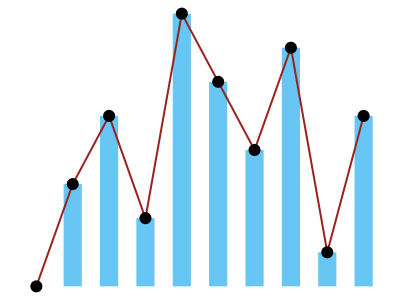

# stats: statistics of a list of numbers

`#include <stats.hpp>`

The `stats` module is a C++ version of Princeton's
[StdStats](https://introcs.cs.princeton.edu/java/stdlib/javadoc/StdStats.html):
the average, median, spread and extremes of a list of numbers, and quick
plots of them on the canvas.

```cpp
#include <input.hpp>
#include <stats.hpp>
#include <iostream>

int main() {
    std::vector<double> scores = input::readAllDoubles();   // ./scores < scores.txt
    std::cout << "average " << stats::mean(scores) << "\n";
    std::cout << "median  " << stats::median(scores) << "\n";
    std::cout << "spread  " << stats::stddev(scores) << "\n";
    stats::plotBars(scores);
}
```

The header [`include/stats.hpp`](../include/stats.hpp) documents every
function.

## What the functions take

Every function takes a `std::vector<double>`, a `std::vector<int>`, or a
list in braces:

```cpp
std::vector<int> rolls = {3, 6, 2, 6, 1};
int best = stats::max(rolls);            // an int, for a vector of ints
double typical = stats::median(rolls);   // 3
double m = stats::mean({2.5, 4, 9});     // 5.16667
```

These are the vectors that `input::readAllDoubles()` and
`input::readAllInts()` return (see [input](input.md)), so reading a data file
and summarizing it takes a few lines.

## Functions

| Function | Gives |
|---|---|
| `sum(v)` | The total; 0 for an empty vector. For ints it is a `long long`, so a large total doesn't overflow. |
| `min(v)`, `max(v)` | The smallest and the largest value (an `int` for ints). |
| `mean(v)` | The average: the sum divided by the number of values. |
| `median(v)` | The middle value once the values are sorted, or the average of the two middle values. `v` itself is not reordered. |
| `variance(v)`, `stddev(v)` | The sample variance and standard deviation, dividing by n − 1 as StdStats does. They need at least two values. |
| `plotPoints(v)` | A dot at (i, `v[i]`) for each value. |
| `plotLines(v)` | A line through the points, from left to right. |
| `plotBars(v)` | A bar from 0 to each value; negative values go down. |

## Plots

The plot functions draw on the canvas with the current pen colour (and pen
width, for lines). Each first sets the scale so the values fit:

- x from −1 to n, so value i is at x = i and there is room at both ends;
- y from a little below the smallest value to a little above the largest;
  bars always include 0.

The plots can be combined. With a 0 among the values, all three use the same
scale, so they line up:

```cpp
std::vector<double> v = {0, 3, 5, 2, 8, 6, 4, 7, 1, 5};
canvas::setPenColor(canvas::BOOK_LIGHT_BLUE);
stats::plotBars(v);
canvas::setPenColor(canvas::BOOK_RED);
stats::plotLines(v);
canvas::setPenColor(canvas::BLACK);
stats::plotPoints(v);
```



To add labels or a line for the mean, draw in the same coordinates after the
plot: value i is at x = i, and the y coordinates are the values themselves.

```cpp
stats::plotBars(v);
double m = stats::mean(v);
canvas::setPenColor(canvas::BOOK_RED);
canvas::line(-1, m, 10, m);   // across the plot: x goes from -1 to 10 for 10 values
```

For a plot with your own scale, call `canvas::setScale` (or `setXscale` and
`setYscale`) after the plot function and draw the rest yourself, or draw the
whole plot with `canvas::point`, `canvas::polyline` and
`canvas::filledRectangle`.

## Errors

Mistakes stop the program with a message and exit status 1, for example:

```
stats: mean: the vector is empty
stats: stddev: needs at least 2 values, not 1
stats: median: values[1] is NaN
stats: plotBars: values[0] is infinite
```

NaN ("not a number", from `0.0 / 0` or `std::sqrt(-1)`) is always an error,
because it makes comparisons, and so `min`, `max` and `median`, meaningless.
An empty vector is an error everywhere except `sum`, whose total is 0.

## Differences from Princeton's StdStats

| StdStats | stats | Why |
|---|---|---|
| `StdStats.var(a)`, `stddev(a)` | `stats::variance(v)`, `stddev(v)` | The full word is clearer. |
| `varp`, `stddevp` (population variance) | Not included | One choice is enough in a first course; the sample versions are the usual ones. |
| Arrays of `double` and `int` | Vectors of `double` and `int`, or a list in braces | Vectors are what C++ students use, and what `input` returns. |
| `plotPoints` etc. set only the x scale | They set both scales | The plot always fits, with no setup. |
| `IllegalArgumentException` | Message and exit | Clearer for beginners than an uncaught exception. |

## Examples

- [`examples/average.cpp`](../examples/average.cpp): the average, median,
  standard deviation, smallest and largest of numbers on standard input:
  `./average < examples/data/numbers.txt`.
- [`examples/textbook/bernoulli.cpp`](../examples/textbook/bernoulli.cpp):
  coin-flip experiments, with their mean and standard deviation next to the
  curve's.
